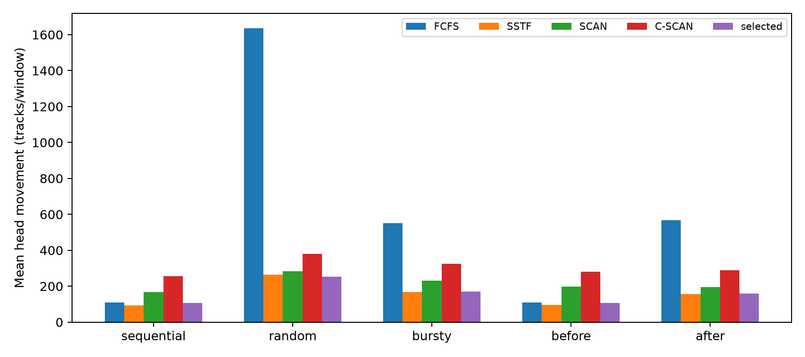
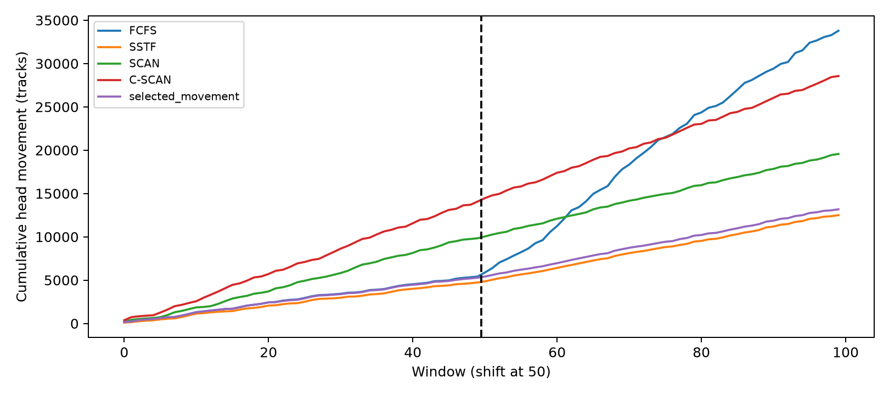
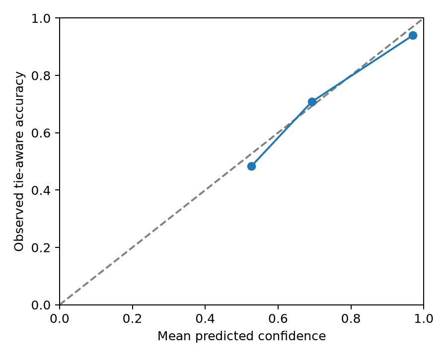

# Learned Disk Scheduler Selector

**CSE307 Operating Systems - Track 2**  
**Name:** Najifa Raksanda  
**Student ID:** 202414010

This project compares FCFS, SSTF, SCAN and C-SCAN using synthetic disk requests. A small decision-tree classifier looks at each request window and predicts which scheduler will produce the least head movement. The experiment also checks how the predictions change when the workload changes halfway through, and whether the model is more confident when its choices are correct.

I ran the project in Kali Linux using Oracle VirtualBox. It is a Python simulation based on the disk-scheduling model taught in class.

## Running the project

Open a terminal in the project folder, then run:

```bash
sudo apt update
sudo apt install -y python3 python3-venv python3-pip git
python3 -m venv .venv
source .venv/bin/activate
python -m pip install -r requirements.txt
python -m unittest discover -s tests -v
python experiment.py --seed 307
```

The experiment writes its CSV files and charts to `results/`. Activate the virtual environment again with `source .venv/bin/activate` when opening a new terminal.

## Project files

| File or folder | Purpose |
|---|---|
| `schedulers.py` | Implements the four schedulers and calculates their head movement |
| `experiment.py` | Generates requests, trains the classifier, evaluates predictions and creates results |
| `requirements.txt` | Lists the Python dependencies |
| `tests/` | Checks the lecture example, bounds, repeated requests and empty queues |
| `results/` | Contains raw data, summaries, environment details and charts |
| `DEMO.md` | Provides a short code walkthrough |

## Scheduling rules

The simulated disk has cylinders numbered 0 to 199. Each window contains 24 requests.

- **FCFS** serves requests in arrival order.
- **SSTF** serves the nearest request next. Equal-distance ties follow arrival order.
- **SCAN** starts toward cylinder 0 and reaches that endpoint before reversing if higher requests remain.
- **C-SCAN** also starts toward 0, then returns to 199 and continues downward. The return movement is included in the cost.

Each window ends when its final request is served. The tests reproduce the class example with head position 53 and queue `98, 183, 37, 122, 14, 124, 65, 67`: FCFS gives 640 tracks, SSTF 236, SCAN 236 and C-SCAN 386.

## Workloads and classifier

The experiment uses three request patterns:

- **Sequential:** requests follow increasing or decreasing steps of 1 to 3 tracks, clipped at the disk boundaries.
- **Random:** requests are distributed uniformly across the disk.
- **Bursty:** most requests cluster around a center, with about 15% scattered elsewhere. Here, bursty means spatial clustering; arrival times are not simulated.

The classifier uses seven features: mean track, track variance, average jump between consecutive requests, fraction of requests at or below the head, fraction of unique requests, average distance from the head and initial head position.

Training uses 1,200 windows with seed 307. Each training window is labeled with the scheduler that produces the least movement. Ties follow the order FCFS, SSTF, SCAN and C-SCAN. The decision tree has a maximum depth of 5 and requires at least 20 training samples in each leaf.

Testing uses a separate random generator with seed 308 and 150 new windows for each workload. The model stays fixed during testing. Scheduler costs are used for training labels and evaluation, but are not supplied as prediction features.

## Workload shift

A separate timeline contains 100 windows. Windows 0–49 are sequential, and windows 50–99 are bursty.

The selected scheduler's final head position becomes the starting head for the next window. All four schedulers are compared using that same starting head and queue within each window. This compares their choices on equal conditions; it does not model four separate continuous head trajectories. SCAN and C-SCAN restart downward in each window.

## Measurements

The cost is total head movement:

```text
Total movement = sum of absolute differences between successive head positions
```

Movement is measured in tracks and used as a proxy for seek time. It is not physical disk latency in milliseconds.

A prediction counts as correct if its selected scheduler ties for the smallest movement among the four policies. **Regret** is the extra movement compared with the best policy for that window. The best-policy value, called the oracle in the output, is only a reference for evaluation.

Confidence is the model's highest predicted class probability. `calibration.csv` groups predictions by confidence and compares their average confidence with observed correctness.

## Results from my Kali run

| Workload | Windows | Selection accuracy | Mean regret (tracks/window) |
|---|---:|---:|---:|
| Sequential | 150 | 65.33% | 13.81 |
| Random | 150 | 76.67% | 5.22 |
| Bursty | 150 | 89.33% | 4.05 |
| Before shift | 50 | 74.00% | 11.04 |
| After shift | 50 | 90.00% | 2.70 |

For random requests, the classifier's selections total 38,087 tracks, compared with SSTF's 39,425. However, SSTF performs better on the sequential and bursty groups. The learned selector therefore does not improve every workload.

After the shift, accuracy increases from 74% to 90% and mean regret decreases. Absolute movement still increases because the workload itself changes.

Mean confidence is 85.79% for correct selections and 62.34% for incorrect ones. The confidence bins show some overconfidence, especially in the highest bin: average confidence is 96.97%, while observed accuracy is 93.95%. Higher confidence on correct choices is useful, but does not prove perfect calibration.







## Limitations

The simulation does not include rotational latency, transfer time, new arrivals during servicing, starvation or fairness measurements. Results are based on synthetic finite queues and one seed pair.

C-SCAN never receives a winning training label in this run, so the classifier does not learn to select it. Its circular waiting-time advantages are outside the movement-only objective. Training probabilities refer to one tie-resolved label, while evaluation accepts any tied best scheduler; this also limits the interpretation of calibration.

The environment and library versions are recorded in `results/metadata.json`.

## References

1. Khaled Hasan Irfan, *Disk Scheduling: Architecture & Algorithms*, CSE307 Operating Systems, Spring 2026, course slides.
2. scikit-learn developers, [Decision Trees](https://scikit-learn.org/stable/modules/tree.html).
3. scikit-learn developers, [Probability calibration](https://scikit-learn.org/stable/modules/calibration.html).

## AI assistance disclosure

I used ChatGPT/Codex for guidance on the project steps, help with coding, and assistance with documentation. I ran the experiment in Kali Linux using Oracle VirtualBox.
